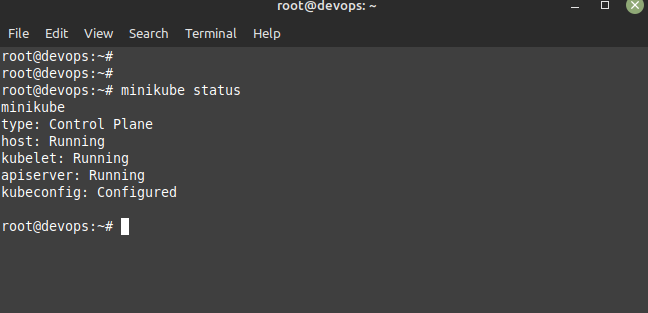
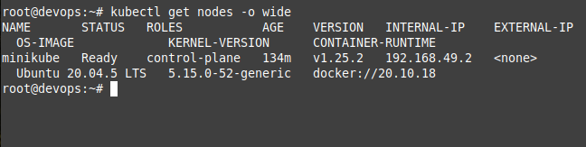

## Desafio 1
Creaccion de archivo readme con imagenes para kubectl y minikube
> NOTA: La instalacion se hizo bajo Linux Mint 21 Cinamon
### Imagen1: 
- Minikube status

### Imagen2:
- kubectl get nodes -o wide

